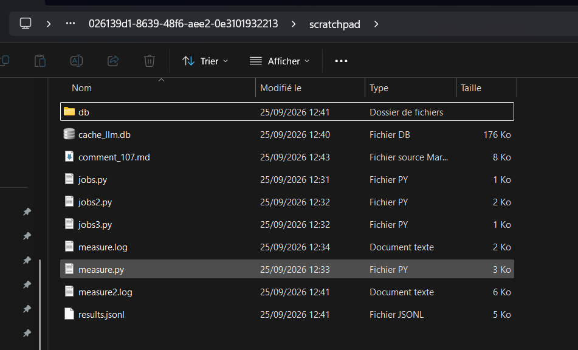

# Measurements for issue #107 (Lab 1, step 3)

This directory was moved (cut and paste) on 30/09/2026 from Claude's temporary directory of an earlier session. I started a new session to stay out of the "dumb zone", when the context window gets too full. The original location was:

```
C:\Users\DELL_G15_5330\AppData\Local\Temp\claude\D--OneDrive---Fondation-EPF-Ubuntu-5A-Web-Services-OceENS-fork\026139d1-8639-48f6-aee2-0e3101932213\scratchpad
```

The measurements were taken on 25/09/2026, with smoke-test step 5 (`gemma4:26b` on Ollama EPF), on a throwaway copy of the demo database.

The original directory before the move. Every file is dated 25/09/2026:



My answer on issue #107 (`issue107-reponse.md`) points to this README for the details.

On 02/10/2026 the directory was brought over, unchanged, from `course-2026` to `course-2026-fallback-clean-bench`, the branch Lab 2 starts from, and the Design Document v1 was added to it.

## What is inside

The `.db` and `.log` files are ignored by git (`.gitignore`), so they are **only on my machine**. The other files are on my fork.

| File | Where | What it proves |
| --- | --- | --- |
| `db/db_oceens.db` | Local only | Table `summaries`, column `metadata_text`: the 16 real calls (10 × HTTP 200, 2 × 500, 4 × 400). Survey 1 has 85 rows, which is my A = 85. The 69 jobs that were not generated are set to `http_status = -1`. |
| `cache_llm.db` | Local only | The cached LLM responses: replaying a job takes 0.01 s, with no GPU. |
| `measure.log`, `measure2.log` | Local only | The output of the two measurement runs. |
| `results.jsonl` | Fork | For each call: start time, wall-clock time, input and output tokens, and `metadata_text`. |
| `measure.py`, `jobs.py`, `jobs2.py`, `jobs3.py` | Fork | The scripts used to queue the jobs and time them. |
| `issue107-reponse.md` | Fork | My answer for issue #107, adapted to the Instructor's v0 (the Group's assumptions, with my measurements as checks). |
| `template_v0_issue_body.md` | Fork | The Instructor's v0: the body of issue #107 since he rewrote it on 29/09/2026. This is the template that `issue107-reponse.md` follows. |
| `design-document-v1.md` | Fork | My Design Document v1 (Lab 2), written on 02/10/2026: the Instructor's v1 with my measurements as checks, including assumption D and what the seam's callers see. It continues `issue107-reponse.md`. |
| `template_v1_issue_body.md` | Fork | The Instructor's v1: the body of issue #105 as it was on 02/10/2026. This is the template that `design-document-v1.md` follows. |
| `spec-summary-progress.md` | Fork | My Spec (Lab 2), written on 02/10/2026 from section 4 of `design-document-v1.md`: the body of issue #151 on `EPF-MDE/OceENS`. Its acceptance numbers are my measured ones (85 jobs, 22 s). |
| `template_xav.md` | Fork | The Instructor's comment of 29/09/2026. Below its first line it holds my **earlier** issue body (the old blank template, "Assumptions (mine)"), not the new template. |
| `image.png` | Fork | The screenshot above: the original directory and its file dates. |

`comment_107.md`, visible in the screenshot, was removed on 01/10/2026: it was my first answer, and the same text is still on GitHub ([comment of 25/09/2026](https://github.com/EPF-MDE/OceENS/issues/107#issuecomment-5831085038)).

## Showing the proof at the Oral

On my machine, open `db/db_oceens.db` (for example with DB Browser for SQLite) and run:

```sql
SELECT summary_id, question_id, module_id, http_status, metadata_text
FROM summaries WHERE http_status NOT IN (0, -1);
```
